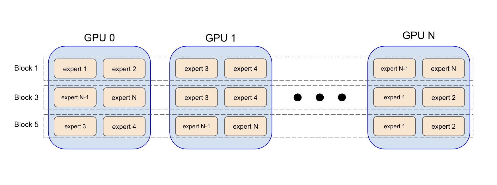
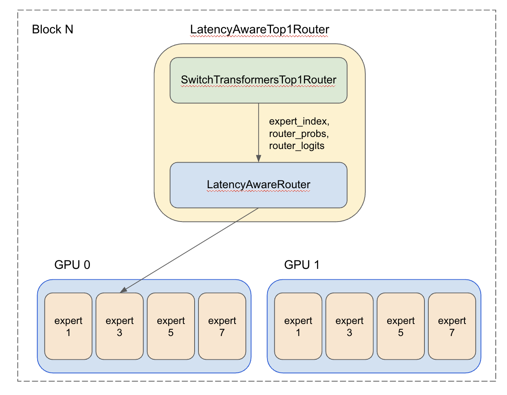
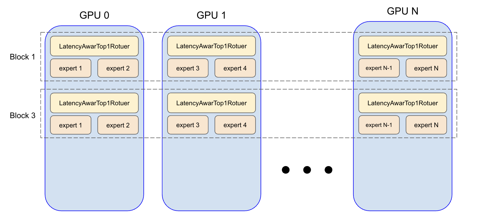
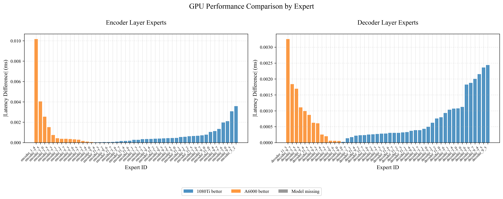
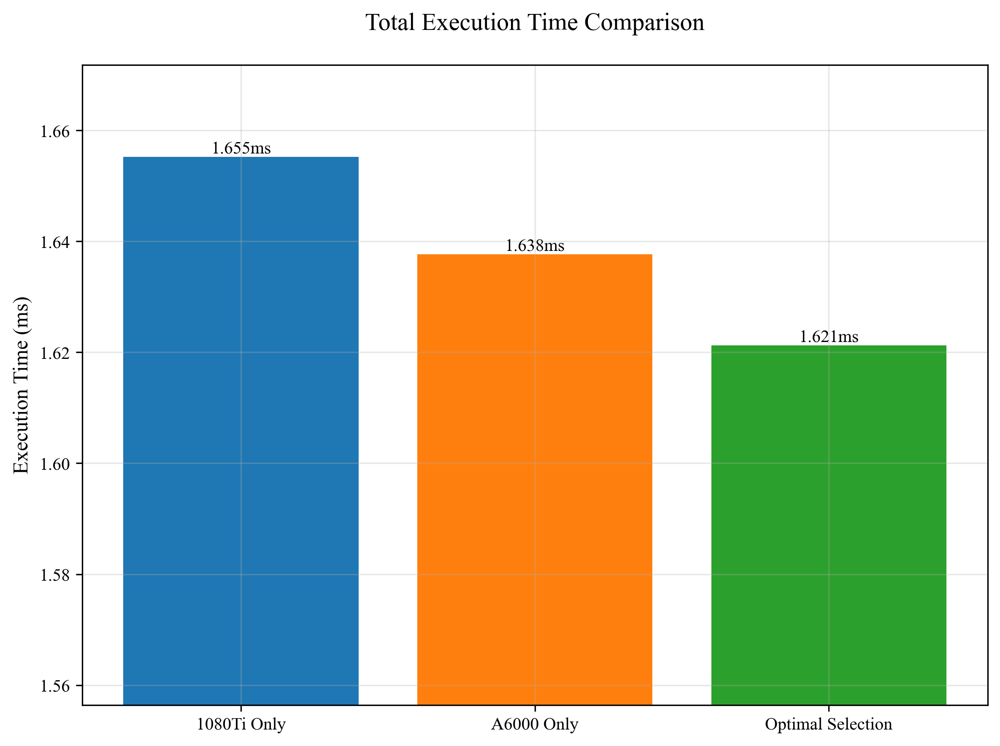
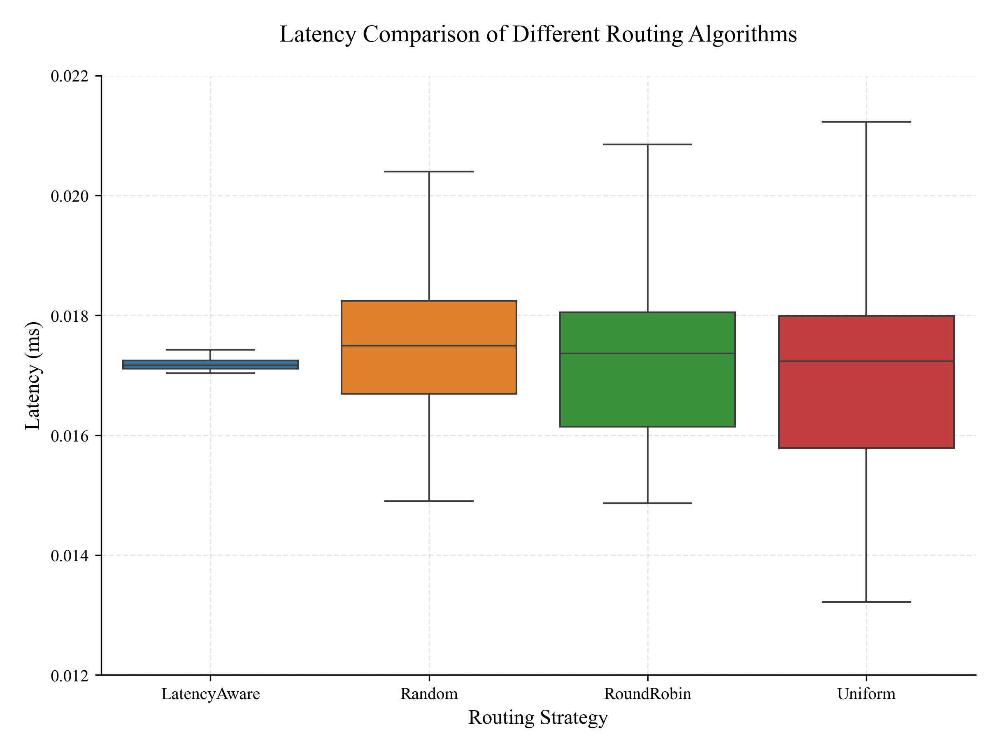
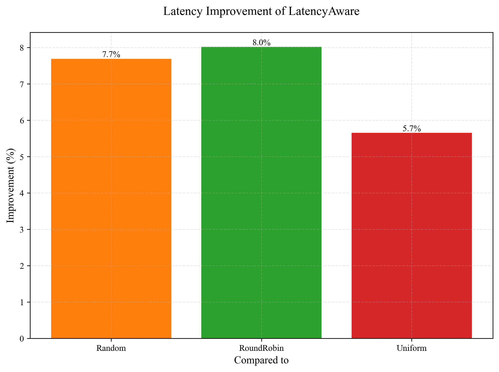

# Switch Transformer with Dynamic GPU Routing

**Efficient Expert Scheduling and Dynamic Routing in Multi-GPU Environments**

---

# Overview

Switch Transformer 기반 Mixture-of-Experts(MoE) 모델은 추론 효율성과 성능을 동시에 확보할 수 있지만, Serving 단계에서는 GPU 간 부하 불균형 및 지연 시간(latency) 증가 문제가 발생합니다. 이 프로젝트는 GPU-aware Expert 분산 배치와 Latency-aware Dynamic Routing 전략을 통해 이러한 한계를 극복하고, 실시간 추론 환경에서도 효율적인 Expert 활용을 가능하게 합니다.

---

# Key Contributions
- GPU-Aware Expert 배치: Expert별 latency profiling 결과를 바탕으로, 각 Expert를 최적의 GPU에 정적으로 배치
- Latency-Aware Top1 Routing: Router Score, Entropy, Token Count 등의 피처를 활용한 MLP 기반 latency 예측 모델로, 실시간 동적 라우팅 수행
- Hybrid Serving 아키텍처: 정적 Expert 분산 + 동적 라우팅을 통합한 하이브리드 추론 시스템 구현
- 정량적 평가: 기존 Random, RoundRobin, Uniform 라우팅과 비교 실험을 통해 평균 latency 5.7%~8.0% 개선 확인

---

# 프로젝트 구조
```
.
├── analysis/                # 성능 분석 및 실험 결과 분석
├── data_processors/         # 데이터 전처리 및 처리 관련 코드
├── docs/                    # 문서화
├── dynamic_routing/         # 동적 라우팅 구현 및 시뮬레이션
├── multi_gpu/              # 다중 GPU 관련 구현
├── profiler/               # 성능 프로파일링 도구
├── results/                # 실험 결과 및 출력물 저장
├── utils/                  # 유틸리티 함수 모음
├── convert_to_mlp.py       # MLP 변환 스크립트
├── latency_aware_top1_router.py  # 지연시간 인식 라우터 구현
├── requirements.txt        # 프로젝트 의존성 목록
├── serving_switch_model.py # 모델 서빙 관련 코드
└── switch_trasnformer.py   # Switch Transformer 핵심 구현
```

---

# 시스템 아키텍처

## 1. GPU-Aware Expert 분산 배치

- 여러 GPU에 Expert를 효율적으로 분산하여 배치하는 구조입니다.
- 각 블록별로 Expert가 GPU에 나누어져 할당됩니다.



---

## 2. Latency-Aware Top1 Routing

- 라우터가 각 토큰을 지연 시간(latency)을 고려하여 최적의 Expert와 GPU로 동적으로 라우팅합니다.
- SwitchTransformersTop1Router와 LatencyAwareRouter의 결합 구조를 보여줍니다.



---

## 3. Hybrid System Overview

- 전체 시스템의 하이브리드 구조를 시각화한 다이어그램입니다.



---

# 실험 결과 요약

### 1. GPU별 Expert 성능 비교

각 GPU에서 Expert들의 처리 시간(latency) 차이를 분석한 결과입니다:



- Encoder Layer: GTX 1080Ti가 일부 Expert에서 더 우수한 성능
- Decoder Layer: A6000이 대부분의 Expert에서 우수한 성능
- Expert ID별로 최적의 GPU가 다르게 나타남

## 2. 전체 실행 시간 비교

Expert 배치 전략에 따른 전체 실행 시간 비교:



- 1080Ti Only: 1.655ms
- A6000 Only: 1.638ms
- Optimal Selection: 1.621ms (약 2% 성능 향상)

## 3. 라우팅 알고리즘 성능 비교

다양한 라우팅 전략의 지연 시간 비교 분석:



- LatencyAware 라우터가 가장 안정적이고 낮은 지연 시간 보임
- Random, RoundRobin, Uniform 대비 더 나은 성능 달성

## 4. LatencyAware 라우팅의 성능 개선율

기존 라우팅 방식 대비 LatencyAware의 개선 효과:



- RoundRobin 대비: 8.0% 개선
- Random 대비: 7.7% 개선
- Uniform 대비: 5.7% 개선

## 5. 성능 개선 요약

| 실험 항목 | 결과 요약 |
|-----------|-----------|
| GPU별 Expert 처리 latency | Encoder는 GTX 1080Ti, Decoder는 A6000이 우세 |
| Expert 배치 전략별 전체 latency | GPU-aware Optimal 배치 시 2% latency 개선 |
| 라우팅 알고리즘 비교 | Latency-Aware 방식이 평균 latency 8% 감소 |
| 동적 라우팅 시뮬레이션 | 대부분의 토큰이 최적 GPU로 효과적 분산 |
---

# 실행 방법

```bash
# 설치
pip install -r requirements.txt

# latency 예측 모델 학습
python latency_predictor_mlp.py --train

# 라우터 적용하여 Switch Transformer 실행
python switch_transformer.py --routing latency-aware --gpu-map expert_gpu_map.json
```

---

# 주요 기술 스택
- Python, PyTorch
- CUDA, NCCL 기반 GPU 분산 처리
- Switch Transformer (google/switch-base-8)
- MLP 기반 latency 예측 (8차원 입력 feature)

---

# 데이터 및 리소스
- 데이터셋: AG News + OpenWebText에서 샘플링한 5,000개 문장
- GPU 구성: GTX 1080Ti, RTX A6000
- 분석 도구: fvcore, torchinfo, nvprof, Prometheus (계획)

---

# 참고 문헌
- [Fedus et al., 2021] Switch Transformer [arXiv:2101.03961](https://arxiv.org/abs/2101.03961)
- [DeepSeek, 2024] EPLB Load Balancing [GitHub](https://github.com/deepseek-ai/EPLB)
